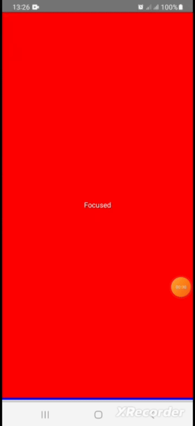
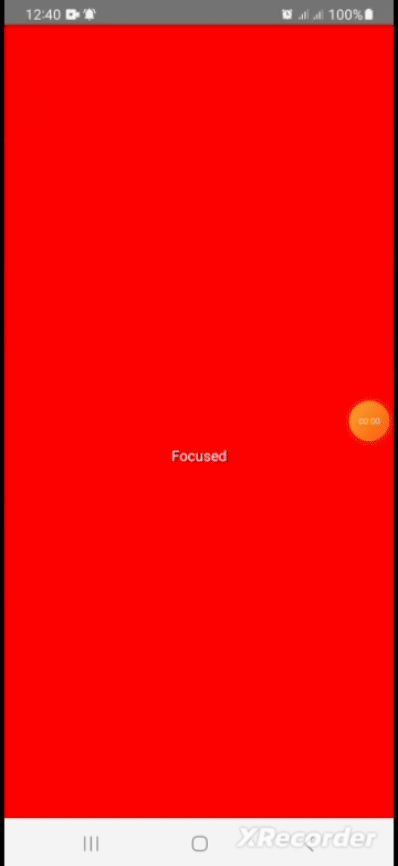

# react-native-viewport
[](https://opensource.org/licenses/MIT)

A fully customizable React Native wrapper to check whether a component is in the view port to track impressions
  ## Demos
  ##### 1. Track if the view container is 100% visible on the screen

##### 2. Set a custom minimum value to Track and trigger visible if the view container is visible on the screen (For this case, the minimum value 70% to trigger isVisibility)


## Installation

```sh
    npm i @herberthtk/react-native-viewport
```
Or
```
    yarn add @herberthtk/react-native-viewport
```

## Usage


```js
import InViewport from '@herberthtk/react-native-viewport';

 const Section = () => {
  const [focused, setFocused] = useState(false);

  const handleChange = useCallback((isVisible: boolean) => {
    setFocused(isVisible);
  }, []);

  const backgroundColor = focused ? 'red' : '#ccc';

  return (
    <InViewport
      threshold={0.7}
      delay={100}
      onChange={handleChange}
      style={[styles.section, { backgroundColor }]}
    >
      <Text style={focused ? { color: '#fff' } : { color: '#000' }}>
        {focused ? 'Focused' : 'Not focused'}
      </Text>
    </InViewport>
  );
};

const App = (): React.JSX.Element => {
  return (
    <SafeAreaView style={styles.container}>
      <ScrollView>
        {[...new Array(5)].map((_, k) => (
          <Section key={k} />
        ))}
      </ScrollView>
    </SafeAreaView>
  );
};

const styles = StyleSheet.create({
  container: {
    flex: 1,
  },
  section: {
    width: Dimensions.get('screen').width,
    height: Dimensions.get('screen').height,
    justifyContent: 'center',
    alignItems: 'center',
    borderBottomColor: 'blue',
    borderBottomWidth: 4,
  },
});

export default App;

```

#### Component props

| Property | type | Required | Description | Default value |
| ---------| ------- | ------- | -------- | -------- |
| disabled | boolean  | false  | If enabled the component will not track visibility status    | false |
| delay    | number | false   | How frequent to check visibility status. Not setting lower less than a second will increase frequency of updates leading performance issues especially in old architecture bridge mode   | 1000ms |
| threshold | number | false | Any number that is greater than 0 but less than or equal to 1, 1 means 100% 0.7 means 70% and so on, The value indicate the minimum percentage of the container to be considered visible    | 1 |
| onChange          | Function |  true | This is the core and exposed method that listens and updates visibility status | undefined |

This component also accepts all properties of the `View` component like `style` [Check full list of properties here](https://reactnative.dev/docs/view)

#### Contributing

See the [contributing guide](CONTRIBUTING.md) to learn how to contribute to the repository and the development workflow.

#### License

MIT

---

Made with [Herbert kavuma](https://herbert.netbritz.com/)
